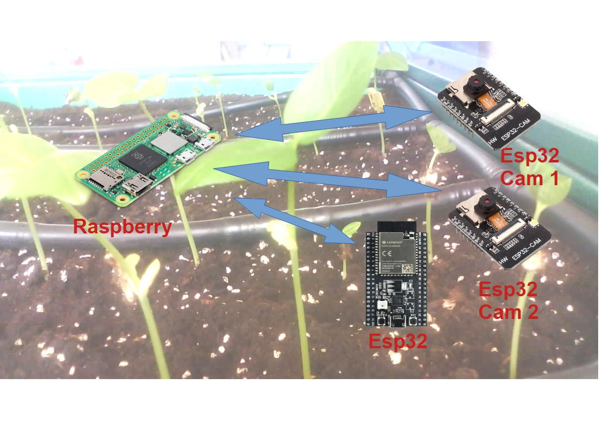
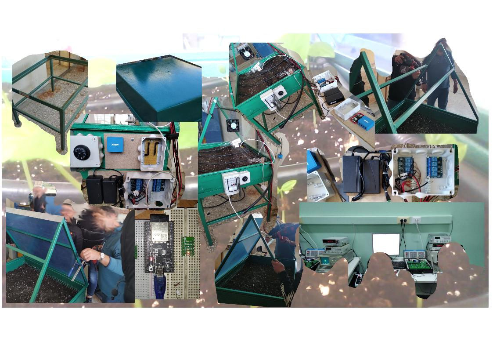
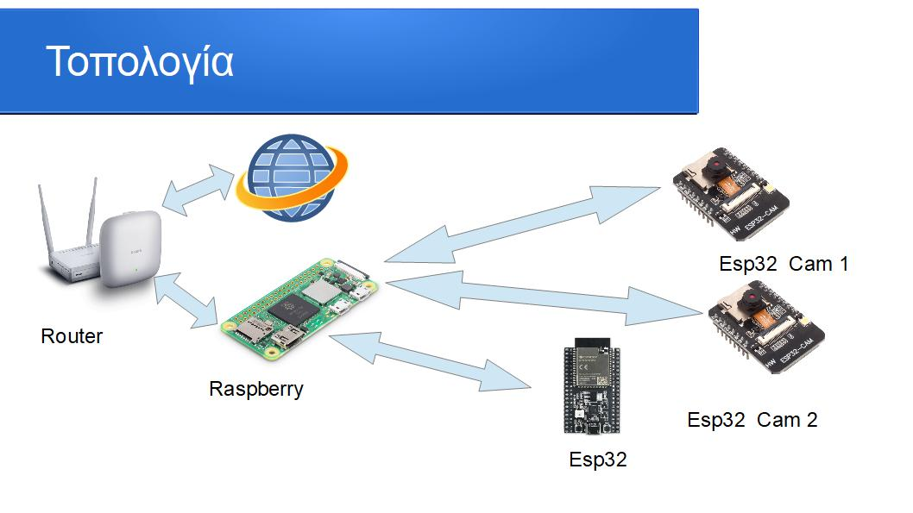
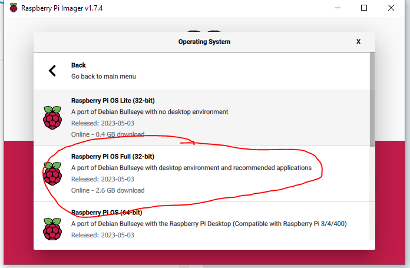

# Πράσινη Ανάπτυξη
Έργο για τον Διαγωνισμό Ανοιχτών Τεχνολογιών
   
**Ομάδα:  "Πράσινη Ανάπτυξη."** (Μαθητές της Β' Ηλεκτρολογίας και της Γ Γεωπονίας του ** ΕΠΑΛ Θήβας**  )

**Σχολείο:** ΕΠΑΛ Θήβας.

**Τίτλος έργου:** «Αυτοματοποίση και Καταγραφή Ανάπτυξης Φυτών Με Χαμηλό Αποτύπωμα Ενέργειας »

______

# Περιγραφικό Διάγραμμα του Συστήματος

___

______

# Η ΠΡΟΤΑΣΗ  ΕΡΓΟΥ

___

Στο παραπάνω περιγραφικό Διάγραμμα  , δίνουμε εποπτικά  την δόμηση και λειτουργία του προτεινόμενου συστήματος, που αποτελεί την πρόταση έργου για την συμμετοχή της ομάδας μας ,**" Πράσινη Ανάπτυξη "**, στον «5ο Πανελλήνιο Διαγωνισμό Ανοιχτών Τεχνολογιών στην Εκπαίδευση».

Στις παρακάτω παραγράφους δίνεται αναλυτικότερη  τεκμηρίωση  του σχεδιασμού και της δομής της πρότασης μας.

Πράσινη ανάπτυξη. 

****

# Εισαγωγή 

Σε αυτό το έργο κάναμε μία προσπάθεια καταγραφής δεδομένων και ελέγχου όλων των παραμέτρων που επηρεάζουν την ανάπτυξη ενός φυτού, με παράλληλη απεικόνιση και καταγραφή της ανάπτυξης του φυτού. Σκοπός του έργου είναι η η ενασχόληση των μαθητών με νέες τεχνολογίες και η οργάνωση της ομάδας σε ένα λειτουργικό αποτέλεσμα. Στην εξέλιξη του έργου διαπιστώσαμε ότι είναι δυνατό να κατασκευάσουμε ένα βίντεο που απεικονίζει την εξέλιξη του φυτού μέσα σε ένα λεπτό. Από τους συμμετέχοντες στο έργο θεωρήθηκε ότι η κατασκευή ενός τέτοιου βίντεο θα λειτουργήσει θετικά στην στην ενίσχυση του ενδιαφέροντος των παιδιών με το έργο.

Βασικοί στόχοι στην αρχική σχεδίαση του έργου ήταν : 

- καταγραφή θερμοκρασίας και υγρασίας περιβάλλοντος
- καταγραφή υγρασίας εδάφους
- έλεγχος θερμοκρασίας εδάφους
- έλεγχο της υγρασίας του εδάφους
- έλεγχο της φωτεινότητας του περιβάλλοντος
- έλεγχος της υγρασία του περιβάλλοντος 
- απομακρυσμένο ελέγχω των δεδομένων υγρασίας και θερμοκρασίας
- καταγραφή εικόνων σε όλα τα στάδια ανάπτυξης του φυτού
- δημιουργία βίντεο με την ανάπτυξη του φυτού 

Όλοι οι παραπάνω σκοποί θα υλοποιηθούν σε ένα πρότυπο φυτώριο του εργαστηρίου Γεωπονίας στο οποίο θα προσπαθήσουμε να ελέγξουμε τις συνθήκες ανάπτυξης του φυτού.

\*Όλοι οι υπερσύνδεσμοι του παρακάτω κειμένου παραπέμπουν σε επίσημες σελίδες των εργαλείων που χρησιμοποιήθηκαν ή  διαδικτυακούς χώρους με πολύτιμη πληροφορία για την υλοποίηση του έργου. 

# Στάδια υλοποίησης του έργου 
______

______
- κατασκευή της βάσης για το φυτώριο
- επιλογή του σχήματος για το σκέπαστρο του φυτωρίου
- κατασκευή του σκέπαστρου 
- επιλογή υλικού για την επικάλυψη του σκέπαστρου και τοποθέτηση του 
- επιλογή των υποστρωμάτων χώματος γερά τα φυτά
-  τοποθέτηση αντίστασης για τον έλεγχο θερμοκρασίας εδάφους
-  τοποθέτηση συστήματος εξαερισμού
-  τοποθέτηση αισθητήρων περιβάλλοντος( θερμοκρασίας, υγρασίας )
- επιλογή Controller για την ανταλλαγή δεδομένων και τον έλεγχο
-  συνδεσμολογία τον  Controller και προγραμματισμό τους για την ορθή λειτουργία του συστήματος
-  διασύνδεση του συστήματος με  οθόνη tablet για την παρουσίαση όλων των δεδομένων και τον έλεγχο του συστήματος

Κατά τη διάρκεια της υλοποίησης του έργου τα παιδιά λειτούργησαν με έντονο ενθουσιασμό παρά του γεγονότος ότι τα προβλήματα που αντιμετωπίσαμε σε όλα τα βήματα ήταν αρκετά. Αξιοσημείωτα ήταν επίσης τόσο οι λύσεις και οι προτάσεις  που έδιναν τα παιδιά σε κάθε πρόβλημα που παρουσιάζονταν μπροστά μας καθώς και ο ζήλος σε όλη τη διάρκεια υλοποίησης του έργου. 

# Τοπολογία λειτουργία και προγραμματισμός του συστήματος 
_____

_____
Οι βασικοί κόμβοι του συστήματος είναι

-  ένα  Raspberry Zero
-  ένα esp32 και τον βασικό έλεγχο control
-  δύο esp32 cam  για την καταγραφή των εικόνων
-  ένα access point για τη διασύνδεση του συστήματος με το internet

Στις ακόλουθες παραγράφους θα προσπαθήσουμε με σύντομο τρόπο να παραθέσουμε όσο πιο ολοκληρωμένα μπορούμε όλη την πορεία εργασίας μας, τα εργαλεία που χρησιμοποιήσαμε και τον προγραμματισμό όλων των εξαρτημάτων. 

## Raspberry Zero

### Εγκατάσταση λειτουργικού συστήματος 

Όπως πιθανόν να είναι γνωστό το Raspberry Zero  είναι ένας υπολογιστής με ολοκληρωμένο και γραφικών λειτουργικό σύστημα το οποίο επιλέχθηκε για την ευκολότερη και φιλικότερη  ενασχόληση των παιδιών. Το κατέβασμα και εγκατάσταση του Λειτουργικού συστήματος έγινε από την επίσημη σελίδα του [Raspberry OS](https://www.raspberrypi.com/software/)  Και κάπου εκεί ξεκίνησαν και τα προβλήματα Διαπιστώσαμε ότι η 64-bit εκδόσεις του λειτουργικού συστήματος δεν ήταν συμβατές με την εγκατάσταση του node- red. Το οποίο ήταν το βασικό εργαλείο προγραμματισμού του Raspberry παρακάτω παραθέτουμε την εικόνα για τη διευκόλυνση  οποιουδήποτε θέλει να κάνει κάτι παρόμοιο με εμάς. 

### Εγκατάσταση to node red 

<iframe src="https://www.youtube.com/embed/oLCSqbk-WOY" 
        title="timelapse από το θερμοκήπιο του σχολείου" frameborder="0" allowfullscreen
        allow="accelerometer; autoplay; clipboard-write; encrypted-media; gyroscope; picture-in-picture" 
        style="position: absolute; width: 100%; height: 100%;">
</iframe>

Σε συνεργασία με τα παιδιά και από παλαιότερη  ενασχόληση καταλήξαμε στο βασικό εργαλείο προγραμματισμού του συστήματος να είναι το  [node red ](https://nodered.org/)στο οποίο προχωρήσαμε σε εγκατάσταση σύμφωνα με τις [οδηγίες της επίσημης σελίδας του προγράμματος](https://nodered.org/docs/getting-started/raspberrypi). 

Το node-red είναι ένα  περιβάλλον προγραμματισμό βασισμένο σε κόμβους. Στην αρχική του εγκατάσταση  εγκατασταθεί  όλους τους βασικούς κόμβους στην πορεία όμως του προγραμματισμού, αντιληφθήκαμε ότι δεν ήταν αρκετοί αυτοί οι  κόμβοι έτσι κάναμε εγκατάσταση των παρακάτω παλετών κόμβων. 

- [node-red-dashboard 3.5.0 ](https://flows.nodered.org/node/node-red-dashboard) 
- [node-red-contrib-ui-time-scheduler 1.17.2](https://flows.nodered.org/node/node-red-contrib-ui-time-scheduler/in/590bc13ff3a5f005c7d2189bbb563976)
- [node-red-node-openweathermap 0.5.1](https://flows.nodered.org/node/node-red-node-openweathermap)

### Εγκατάσταση του MQTT broker 

Ο MQTT broker που επιλέχθηκε για την υλοποίηση του έργου είναι ο Eclipse Mosquitto Χρησιμοποιώντας τις οδηγίες εγκαταστάσεις  από την σελίδα[ Install Mosquitto MQTT Broker on Raspberry Pi](https://randomnerdtutorials.com/how-to-install-mosquitto-broker-on-raspberry-pi/) . Στην σελίδα παρέχονται πληροφορίες τόσο για την εγκατάσταση του συγκεκριμένου προγράμματος όσο και για την λειτουργία του MQTT broker. 

## esp32 

### Διαμόρφωση του esp32 με τη βοήθεια του Tasmota 

Οι δύο λόγοι που οδήγησαν να επιλέξουμε το [Tasmota ](https://tasmota.github.io/docs/)ως εργαλείο διαμορφώσεις του esp32 είναι αφενός το αρκετά μεγάλο πλήθος των αισθητήρων και των εξόδων του Controller,  και αφετέρου ο εύκολος τρόπος διαμόρφωσης, πού ήταν πολύ  φιλικότερο για τους μαθητές. Η σελίδα με την οποία κάναμε τη διαμόρφωση του esp32  είναι [Install Tasmota](https://tasmota.github.io/install/)  

και το αρχείο με το configuration που χρησιμοποιήθηκε είναι το ### στον καταλογο ### .

## esp32 cam 

### Διαμόρφωση και προγραμματισμός to esp32 cam 

Για τις ανάγκες του έργου χρησιμοποιήθηκαν δύο esp32 cam και ο προγραμματισμός τους έγινε μέσω to [Arduino IDE](https://www.arduino.cc/en/software) καθώς διαπιστώθηκε ότι κάλυπτε τις ανάγκες του έργου. Ο πηγαίος κώδικας βρίσκεται στο αρχείο ### στον κατάλογο ###. 

## Εργασίες διασύνδεσης και τροφοδοσίας 

### Διασύνδεση του κυκλώματος ελέγχου 

Ο σχεδιασμός για τις διασυνδέσεις του ελέγχου σχεδιάστηκε στο πρόγραμμα [Fritzing Portable ](https://sourceforge.net/projects/fritzing-portable/) εμπλουτίζοντας τις βιβλιοθήκες του προγράμματος με τα υλικά που χρησιμοποιήσαμε. Το αρχείο με το κύκλωμα δίνεται στο ###  στον κατάλογο ###  και η εικόνα του κυκλώματος στο παρακάτω σχήμα

****

### Κύκλωμα τροφοδοσίας του κυκλώματος  

Το σύστημα απαιτούσε τρεις διαφορετικές τάσεις τροφοδοσίας πού παρουσιάζονται παρακάτω

-  5 volt για τους Controller
-  12 volt για τις ταινίες LED και τους ανεμιστήρες
-  9 volt για την τροφοδοσία της ηλεκτροβάνας που ήταν απαραίτητη για το πότισμα

Το βασικό κύκλωμα για τις τροφοδοσίες του συστήματος σχεδιάστηκε στο πρόγραμμα [QElectroTech ](https://qelectrotech.org/) παρουσιάζεται στην επόμενη εικόνα και το αρχείο ###  στον κατάλογο ###. 

### Κατασκευή πρωτότυπων πλακετών

Στην εξέλιξη εξέλιξη της υλοποίησης χρειάστηκε οι μαθητές να εξασκηθούν στις κολλήσεις προτύπων πλακετών έτσι μπόρεσαν να κάνουν και πρακτική εξάσκηση των θεωρητικών γνώσεων που είχαν ήδη πάρει. Η διαδικασία ενθουσίασε τους μαθητές και το αποτέλεσμα ήταν εντυπωσιακό. 

## Κατασκευή βίντεο από συρραφή εικόνων (Time Lapse) 

###  Αρχικοί υπολογισμοί 

Για την κατασκευή ενός βίντεο από συρραφή εικόνων, (timelapse) απαιτείται ένας αρχικός υπολογισμός, του χρόνου εξελίξεις του γεγονότος ( στην περίπτωση του έργου μας η ανάπτυξη του φυτού)  δια τον συνολικό χρόνο του παραγόμενου βίντεο, υπολογίζοντας ότι κάθε δευτερόλεπτο βίντεο, πρέπει να είναι πάνω από 30 εικόνες το δευτερόλεπτο έτσι ώστε να δίνεται η αίσθηση   της συνεχόμενης κίνησης. 

Παραγωγή του βίντεο. 

 για την παραγωγή του βίντεο από τις φωτογραφίες που κατέγραφαν οι δύο esp32 cam Controller στην SD card to Raspberry Zero χρησιμοποιήθηκε το πρόγραμμα [Chronolapse 1.0.7 - Windows Exe](https://code.google.com/archive/p/chronolapse/downloads) Του οποίου η χρήση αποδείχτηκε  τόσο χρήσιμη και εύκολη όσο και διασκεδαστική για τους μαθητές το αποτέλεσμα που παρήχθη  ήταν εντυπωσιακό και πραγματικά χαροποίησε όλους τους εμπλεκόμενους με το έργο. 

## Επίλογος ευχαριστίες 

Καθόλη τη διάρκεια υλοποίησης του έργου τόσο οι εμπλεκόμενοι καθηγητές όσο και οι μαθητές βγήκαν πολλαπλά ωφελημένοι και σε γνώσεις επιλύοντας τα προβλήματα που προέκυπταν αλλά και σε Εμπειρίες από την συνεργασία και την προσπάθεια οργάνωσης του έργου ένα μεγάλο ευχαριστώ σε όλους τους εμπλεκόμενους στο έργο και μία υπόσχεση για μεγαλύτερα και ωραιότερα μελλοντικά project ΕΥΧΑΡΙΣΤΩ. 
