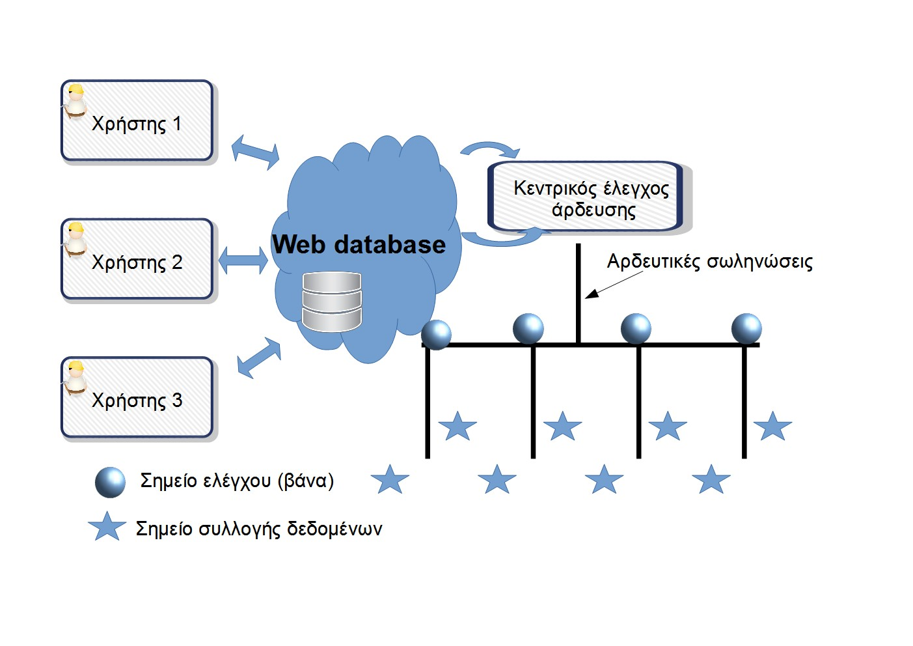

# irrigation-Levadia-Aliartos
Έργο για τον Διαγωνισμό Ανοιχτών Τεχνολογιών
   
**Ομάδα:  "Κωπαΐδα - LoRa Irrigation."** (Μαθητές της Γ' Ηλεκτρολογίας του  **Εσπερινού ΕΠΑΛ Αλιάρτου** και της Γ Ηλεκτρολογίας **Εσπερινού ΕΠΑΛ Λιβαδειάς**)

**Σχολείο:** Εσπερινό ΕΠΑΛ Λιβαδειάς,  Εσπερινό ΕΠΑΛ Αλιάρτου.

**Τίτλος έργου:** «Βελτιστοποίηση ποτίσματος εξωτερικών χώρων με κατανεμημένο έλεγχο και εξοικονόμηση νερού»

______

# Περιγραφικό Διάγραμμα του Συστήματος

___

______

# Η ΠΡΟΤΑΣΗ  ΕΡΓΟΥ

___

Στο παραπάνω περιγραφικό Διάγραμμα  , δίνουμε εποπτικά  την δόμηση και λειτουργία του προτεινόμενου συστήματος, που αποτελεί την πρόταση έργου για την συμμετοχή της ομάδας μας ,**" Κωπαΐδα - LoRa Irrigation "**, στον «4ο Πανελλήνιο Διαγωνισμό Ανοιχτών Τεχνολογιών στην Εκπαίδευση».

Στις παρακάτω παραγράφους δίνεται αναλυτικότερη  τεκμηρίωση  του σχεδιασμού και της δομής της πρότασης μας.

## Εισαγωγή 

Όπως είναι προφανές και από την τοποθεσία των Σχολείων μας, ζούμε σε μία παραδοσιακά Αγροτική περιοχή.  Τα βιώματα όλων,  εκπαιδευτικών και μαθητών,  παραπέμπουν είτε κατά το παρελθόν  είτε κατά την τρέχουσα ενασχόλησή τους  σε **Αγροτική  καλλιέργεια και φυτική παραγωγή**. 

Επίσης ως λάτρειςς της φύσης,  θα μας άρεσε να βλέπαμε περισσότερους  **χώρους πρασίνου**  στις πόλεις μας  και δρόμους πού ανάμεσα στις "άχαρες γκρι ασφάλτινες λωρίδες"  δίνουν χώρο σε  λογής λογής πολύχρωμα φυτά.

Όμως όλα τα προηγούμενα έχουν σαν βασική προϋπόθεση την ύπαρξη και σωστή διαχείριση του νερού,  το οποίο ως γνωστόν είναι η πηγή της ζωής και ταυτόχρονα ένα πολύτιμο αγαθό ,  σε οποιαδήποτε  προσπάθεια στοχεύει στην αειφορία  καθώς και στην κυκλική οικονομία.

Η **εξοικονόμηση και η εκλογικευμένη χρήση  του νερού**  αποτέλεσαν την αφορμή και τη βασική ιδέα του συστήματός μας και της πρότασης έργου που καταθέτουμε. Η στόχευση αυτή έγινε χρησιμοποιώντας  σχεδιαστικούς άξονες και προτεραιότητες  όπως : 

- ενεργειακή αυτονομία  από ανανεώσιμες πηγές ενέργειας
- ανάγκη της απουσίας καλωδίων σε αρδευτικά συστήματα  μεγάλης έκτασης 
- ανοικτή αρχιτεκτονική
- χρήση  τεχνολογιών Ανοικτού κώδικα 
- χρήση φτηνών υπαρχόντων υλικών για εξοικονόμηση χρημάτων
- η ενσωμάτωση υπάρχουσας  εγκατεστημένης  υποδομής
- η κατανεμημένη λογική  στην " ευφυΐα" του συστήματος 

# Περιγραφή

Στο παρόν έργο γίνεται  προσπάθεια εξοικονόμησης ενέργειας και νερού, βελτιώνοντας την ευχρηστία ενός συστήματος άρδευσης. 

Θα χρησιμοποιήσουμε ένα **φωτοβολταϊκό πάνελ** για την τροφοδοσία ενός Controller χαμηλής κατανάλωσης και πολλαπλών ρόλων (π.χ ESP32)-**(Υποσύστημα 1)**. Οι ρόλοι αυτοί , ανάλογα με τη λειτουργικότητα του κόμβου στο δίκτυο,  μπορεί να είναι συλλογή δεδομένων από αισθητήρες ή/και θα ενεργοποίηση βάννών για το πότισμα της καλλιέργειας, κ.τ.λ. 

Θα επιχειρήσουμε να **καταγράψουμε τις ενεργειακές ανάγκες** ενός τέτοιου συστήματος με σκοπό την εξοικονόμηση πόρων και ενέργειας -**(Υποσύστημα 4)**-. Θα χρησιμοποιήσουμε διαφορετικά συστήματα συλλογής και αποθήκευσης ενέργειας έτσι ώστε να οδηγηθούμε σε σωστά και ασφαλή συμπεράσματα σχετικά με το ελάχιστο δυνατό σύστημα που να καλύπτει τις ανάγκες ενός αρδευτικού συγκροτήματος.  

Σίγουρα ένα ολοκληρωμένο και βελτιστοποιημένο σύστημα άρδευσης μπορεί να είναι αντικείμενο περισσότερων έργων από ένα, αλλά ένα από τα βασικότερα σημεία ενός τέτοιου συστήματος είναι η καταγραφή, η ανάλυση και η μελέτη των ενεργειακών αναγκών του συστήματος. Αυτό ακριβώς είναι ο πρωταρχικός στόχος του έργου ο οποίος θα προσπαθήσουμε να εμπλουτιστεί με απομακρυσμένο έλεγχο και συλλογή δεδομένων διατηρώντας  το κόστος του συστήματος όσο μπορούμε πιο χαμηλά.

**Αισθητήρες υγρασίας εδάφους και θερμοκρασίας** θα στέλνουν τα δεδομένα σε μία κεντρική υπολογιστική μονάδα (Raspberry pi) - **(Υποσύστημα 3)**-  μέσω ενός Controller χαμηλής κατανάλωσης όπως είναι ο ESP32.  
Υπολογιστική μονάδα θα μπορεί να συνδεθεί σε **IOT (internet of Things)** πλατφόρμα έτσι ώστε να μπορούμε τόσο να διαβάζουμε τα δεδομένα όσο και να ενεργοποιούμε το σύστημα από οποιοδήποτε σημείο βρισκόμαστε. Στόχος μας είναι επίσης η εκμετάλλευση **μετεωρολογικών  και άλλων δεδομένων**, που παρέχονται διαδικτυακά, έτσι ώστε να συνδράμουμε στην βελτιστοποίηση του συστήματος και στη μεγιστοποίηση εξοικονόμηση πόρων, δίνοντας ταυτόχρονα  μία εναλλακτική  στον έλεγχο του συστήματος- **(Υποσύστημα 5)**. 

Για την επικοινωνία to controller με την υπολογιστική μονάδα θα χρησιμοποιήσουμε δίκτυο Lora - **(Υποσύστημα 2)**-  με σκοπό την κάλυψη μεγάλων αποστάσεων έτσι ώστε το σύστημα να μπορεί να χρησιμοποιηθεί σε πραγματικές καλλιέργειες χωρίς να ανησυχούμε για την εμβέλεια του δικτύου. 
Τους ενεργοποιητές **(Υποσύστημα 6)** , θα προσπαθήσουμε να τους υλοποιήσουμε χρησιμοποιώντας **φτηνές βάνες άρδευσης σε συνδυασμό με σερβομοτέρ** χαμηλής τάσης και ισχύος οι οποίοι θα καταναλώνουν ενέργεια μόνο στο άνοιγμα και στο κλείσιμο του συστήματος χωρίς να εξαρτώνται από την πίεση στο δίκτυο άρδευσης.

---

# Τι παρόμοιο υπάρχει - Τρέχουσα αντιμετώπιση προβλήματος

---

## Τι υπάρχει ήδη 

Στην προσπάθειά μας να ερευνήσουμε την τρέχουσα κατάσταση και να παρατηρήσουμε τι λύσεις υπάρχουν σε παρόμοια προβλήματα καταλήξαμε στις παρακάτω διαπιστώσεις:

 - Στην αγορά υπάρχουν αρκετά συστήματα με τα οποία μπορείς να ελέγξεις  απλά μία ηλεκτρική αντλία άρδευσης **απομακρυσμένα μέσω κινητού τηλεφώνου** .  

 - Επίσης ,υπάρχουν πολύ φθηνά **συστήματα ποτίσματος κήπου** , μικρής κάλυψης  , βασιζόμενα στον χρονοπρογραμματισμό  ,  χωρίς να υπάρχει δυνατότητα απομακρυσμένου ελέγχου ή συλλογής δεδομένων.

## Εντοπισμός προβλημάτων στα υπάρχοντα συστήματα.

Στο εμπόριο υπάρχουν απομακρυσμένοι ενεργοποιητές οι οποίοι δουλεύουν με κάρτες κινητής τηλεφωνίας και μπορούν να ενεργοποιήσουν ή να απενεργοποιήσουν μία ηλεκτρική αντλία σε κάποιο αντλιοστάσιο. Συνήθως στις εγκαταστάσεις που υπάρχει τέτοιο σύστημα το πότισμα γίνεται με μεγάλους εκτοξευτήρες νερού οι οποίοι κάνουν **μεγάλη σπατάλη νερού, δεν δουλεύουν με δυνατό  αέρα** και δεν μπορούν να υποστηρίξουν διαφορετικές ποσότητες νερού σε διαφορετικά κομμάτια του χωραφιού. 

Ηλεκτροβάνες διαφράγματος υπάρχουν αρκετές στο εμπόριο αλλά μπορούν να δουλέψουν **μόνο όταν έχουν πίεση στη σωλήνα και καταναλώνουν ρεύμα** για όλο το διάστημα που είναι ενεργοποιημένες. Σε περίπτωση που ποτίζουμε βράδυ (το προτεινόμενο σύμφωνα με τους γεωπόνους) για την ενεργοποίηση μιας ηλεκτροβάνας διαφράγματος έχουμε μόνιμη κατανάλωση ρεύματος την περίοδο που δεν έχουμε ήλιο , γεγονός που δεν βοηθά στην  αυτονομία της.

Συνήθως σε συστήματα βιομηχανικού αυτοματισμού χρειαζόμαστε πολύ γρήγορα συστήματα χωρίς να μας απασχολεί το πόσο ενεργοβόρα είναι. Σε ένα σύστημα άρδευσης χρειαζόμαστε ακριβώς το αντίθετο πολύ αργά συστήματα (τα  φυσικά μεγέθη ετου ενδιαφέροντος μας, π.χ υγρασία θερμοκρασία, δεν μπορούν να αλλάζουν με γρήγορο ρυθμό). **Μας ενδιαφέρει, όμως, η πολύ χαμηλή κατανάλωση ενέργειας** έτσι ώστε να μπορούν να είναι εύκολα στη μετακίνηση και αυτόνομα ενεργειακά.

Προσπαθώντας να ξεπεράσουμε τα παραπάνω προβλήματα θα προσπαθήσουμε να υλοποιήσουμε ένα σύστημα που να καλύπτει τα ακόλουθα: 

-    Να στηρίζεται σε  **ανοιχτές τεχνολογίες**  προσπαθώντας να αντικαταστήσει κλειστές και πολύ ακριβές κατασκευές
-    Να είναι λόγω των ανοιχτών τεχνολογιών   **εύκολα επεκτάσιμο και εξελίξιμο**
- Να ενεργοποιούμε τα σημεία ελέγχου (βάνες) **όταν υπάρχει περίσσευμα ενέργειας** αλλά να ποτίζουμε τις βραδινές ώρες που είναι καλύτερο για τα φυτά.
- Τα σημεία ελέγχου και συλλογής δεδομένων να είναι **ενεργειακά αυτόνομα με χαμηλή κατανάλωση ενέργειας** και προγραμματιζόμενα περιοδική αποστολή και λήψη δεδομένων.
- Τα σημεία ελέγχου και συλλογής δεδομένων επίσης πρέπει να έχουν τη δυνατότητα επικοινωνίας **σε αρκετά μεγάλες αποστάσεις** ακόμα κι αν παρεμβάλλονται εμπόδια (καλλιέργειες δενδροκομίας).
- Η κεντρική μονάδα ελέγχου του συστήματος δεν μας ενοχλεί να είναι ενεργειακά αυτόνομη γιατί συνήθως θα είναι εγκατεστημένη είτε σε  ηλεκτροδοτούμενο κτίριο είτε σε όχημα που διαθέτει σημαντική ενεργειακή αποθήκη (μπαταρία). 
- Οι βασικές απαιτήσεις της κεντρικής μονάδας θα είναι 
	- η διασύνδεση με το internet,
	- ο χώρος αποθήκευσης δεδομένων
	- η επεκτασιμότητα σε μελλοντικές αναβαθμίσεις
	- το χαμηλό κόστος και η δυνατότητα επισκευής 
	-  αντικατάστασης επιμέρους κομματιών σε περίπτωση βλάβης.
	- Η συλλογή δεδομένων 
	- Η ανάλυσή τους με σκοπό την βέλτιστη Εκμετάλλευση Φυσικών Πόρων/Αποδοτικότητα καλλιέργειας 
-   Το σύστημά μας να μειώνει τις μεταφορές (**εξοικονόμηση πόρων** , καυσίμων και μείωση εκπομπών διοξειδίου του άνθρακα)
-    Να βοηθάει στην  **εξ αποστάσεως εργασία**,  η οποία στις μέρες μας  γίνεται όλο και πιο ελκτική έως και απαραίτητη

Η έρευνά μας έδειξε,  ότι  τα προηγούμενα θεωρούνται αυτονόητα , για μικρούς και μεγάλους καλλιεργητές σε  χώρες του εξωτερικού. Επίσης  χαίρουν ευρείας  αποδοχής και ενδιαφέροντος τόσο  σε επίπεδο ερευνητικό-επιστημονικό όσο  και σε επίπεδο υλοποίησης-εκμετάλλευσης.

Στην περιοχή μας, στον κάμπο της Κωπαΐδας όπου βρίσκονται και τα δύο σχολεία που συμμετέχουν,  **υπάρχει αρκετά μεγάλη αγροτική παραγωγή με σχεδόν μηδενική συλλογή δεδομένων** από τις καλλιέργειες. Ευελπιστούμε ότι η εργασία αυτή θα αποτελέσει ένα κομμάτι από ένα μεγάλο παζλ πού θα οδηγήσει αγρότες, κοινωνία και ειδικούς σε συνεργασία για μία πιο ολοκληρωμένη και οικολογικά ορθολογική διαχείριση των πόρων για τη βελτιστοποίηση της αγροτικής παραγωγής.

---

# Αναγκαιότητα/Στόχοι του Έργου  
---

Σε ένα αρδευτικό σύστημα αναγκαστικά θα πρέπει να εγκαταστήσουμε σωληνώσεις για την άρδευση, αλλά θα μπορούσαμε να έχουμε σημαντική εξοικονόμηση καλωδίων στην συλλογή δεδομένων και στον έλεγχο του συστήματος, και ενέργειας **εκμεταλλευόμενοι τις ανανεώσιμες πηγές ενέργειας** που πλουσιοπάροχα υπάρχουν στη χώρα μας. 

Στην παρούσα προσπάθεια **επιχειρούμε να εξαλείψουμε τα καλώδια από ένα κατανεμημένο σύστημα** ελέγχου και συλλογής δεδομένων, να μετρήσουμε και να αξιοποιήσουμε τις ενεργειακές ανάγκες ενός κατανεμημένου ελέγχω άρδευσης και τέλος **να συνδέσουμε το σύστημα με web** τεχνολογίες έτσι ώστε να μπορούν πολλοί χρήστες να παρακολουθούν **online ή/και ιστορικά δεδομένα** που  αποθηκεύουμε . 

Η βασική σχεδιαστική γραμμή που θα ακολουθηθεί **θα είναι για πραγματική χρήση σε μεγάλες αγροτικές καλλιέργειες** με σκοπό να επαναχρησιμοποιηθεί από επαγγελματίες.

Παράλληλα στόχος είναι να **συλλέξουμε τα πιθανά προβλήματα υλοποίησης** ( πιθανόν να αποτελέσουν προβληματισμό για μελλοντικά project). 

Συνήθως τα αρδευτικά συστήματα υπάρχει :

-  κεντρικό σημείο παροχής νερού (ηλεκτροδοτούμενο ή όχι) στο οποίο δεν έχουμε ιδιαίτερους περιορισμούς στην κατανάλωση ενέργειας 
- και τα επιμέρους σημεία ελέγχου (βάνες) και συλλογής δεδομένων (αισθητήρες)

Η παρέμβασή μας θα είναι , κυρίως στο δεύτερο, έτσι ώστε να τα κάνουμε, αυτόνομα ενεργειακά χρησιμοποιώντας φωτοβολταϊκά στοιχεία. Εκμεταλλευόμενη τη συνεργασία με τα τμήματα φυτικής παραγωγής των ΕΠΑΛ, θα προσπαθήσουμε να σχεδιάσουμε **εξισορροπημμένη παραγωγή (Απόδοση Καλλιέργειας / Εξοικονόμηση ενέργειας και φυσικών πόρων**.

Στις βασικές προτεραιότητες του σύγχρονου κόσμου είναι η εξοικονόμηση ενέργειας, βελτιστοποίηση συστημάτων παραγωγής και μεγαλύτερη φιλικότητα προς το περιβάλλον που τόσο έχουμε κακομεταχειριστεί. Επίσης , σύμφωνα με την ανάλυση των δεδομένων που παρουσιάστηκαν στην προηγούμενη παράγραφο, προέκυψε η ιδέα και η πρόταση για το παρόν σύστημα.

Πιο συγκεκριμένα το σύστημα που προτείνουμε θα έχει τα παρακάτω χαρακτηριστικά τα οποία προσπαθούν να λύσουν τα προβλήματα των υπαρχόντων συστημάτων , βάζοντας τους ακόλουθους τεχνικούς και εκπαιδευτικούς στόχους: 

 - **Αντικατάσταση εμπορικών ελεγκτών ποτίσματος** με ελεγκτές ανοικτού Hardware και ανοικτού κώδικα.

 - **Ασύρματη επικοινωνία ελεγκτών** με χρήση δίκτυο υψηλής εμβέλειας για την αποφυγή καλωδιώσεων και μόνιμων εγκαταστάσεων.

 - Χρήση ελεγκτών ανοιχτού σχεδιασμού με δυνατότητα λειτουργία **sleep** για την εξοικονόμηση ενέργειας, καθώς επίσης μέτρηση και σύγκριση των ενεργειακών αναγκών με άλλους ελεγκτές.

 - Επικοινωνία μέσω **MQTT servers και  IOT**  συστήματος για τον απομακρυσμένο έλεγχο και συλλογή δεδομένων.

 - Βελτιστοποίηση συστήματος ποτίσματος με εξοικονόμηση νερού δυνατότητα καταγραφής των αναγκών σε νερό. 

 - Συλλογή δεδομένων υπαρχόντων αισθητήρων. 

 - Χρήση υπαρχόντων διακοπτών άρδευσης με χρήση σερβομοτέρ χαμηλής κατανάλωσης και τάσης λειτουργίας.

 - **Καταγραφή των αναγκών ενέργειας** ενός συστήματος αυτόματου ποτίσματος.

 - Βελτιστοποίηση αποτελεσματικότητας και κόστους αυτόματου συστήματος άρδευσης με χρήση μη ενεργοβόρων συσκευών και προγραμμάτων ανοικτού κώδικα. 

- Στην κατασκευή  **για χρήση σε  δύσκολα και αφιλόξενα περιβάλλοντα**

 - Στην δημιουργία  κλίματος  στην σχολική κοινότητα που να προωθεί το ενδιαφέρον  για το  περιβάλλον
- Την αφύπνιση  της περιβαλλοντικής συνείδησης των μαθητών

- Την δημιουργία **προτύπου για πειραματισμό σε τεχνολογίες IoT, OpenPLC, LORA, Φωτοβολταϊκών, κ.τ.λ**  

- Την γενικότερη εξοικείωση με τις παραπάνω σύγχρονες τεχνολογίες

- Την προσθήκη μιας πλατφόρμας πειραματισμού και ασκήσεων,  στα εργαστήρια των δύο εμπλεκόμενων Σχολείων

- Την δημιουργία  υποδομής για μελλοντική επέκταση σε κόμβο δικτύου LORAWAN 

---

# Δομή - Χρήση- Υλοποίηση του συστήματος

---

Το σύστημα  σε πλήρη ανάπτυξη (πλήρη υλοποίηση και εφαρμογή σε πραγματικές καλλιέργειες ) θα περιλαμβάνει ,  τα ακόλουθα μέρη:

5. **(Υποσύστημα 1) - Άρδευσης εξωτερικών χώρων** : Σωληνώσεις και παρελκόμενα ποτίσματος, αισθητήρες, ενεργοποιητές (βάνες) και τοπικό ελεγκτή (Arduino , ESP32). Θα μπορεί να λειτουργήσει αυτόνομα και  από άποψη ενέργειας (φωτοβολταϊκή τροφοδοσία ελεγκτών) και προγραμματισμού ποτίσματος ,  χάριν στην CPU των τοπικών ελεγκτών. Η πραγματική δύναμη όμως του συστήματος,  είναι φυσικά στη συνεργασία με τα άλλα υποσυστήματα και τη δικτυακή  καθοδήγηση από τον κεντρικό σταθμό.
5. **(Υποσύστημα 2) - Δικτύωσης αρδευτικών συστημάτων-αισθητήρων** : Βασίζεται κυρίως σε πομποδέκτες   και δίκτυο LoRa (Συντομογραφία για Long Range) . Με αυτό θα επιτυγχάνεται η επικοινωνία μεταξύ του τοπικού ελεγκτή και του κεντρικού σταθμού.  Οι προδιαγραφές του προτύπου ταιριάζουν με την δική μας υλοποίηση που απαιτεί  χαμηλούς ρυθμούς δεδομένων αλλά  ταυτόχρονα και μεγάλη εμβέλεια σε μακρινές αποστάσεις
5. **(Υποσύστημα 3) - Κατανεμημένου ελέγχου** : Η καρδιά του συστήματος θα είναι ένας κεντρικός σταθμός  Raspberry Pi  , ανα   αγροτεμάχιο, το οποίο ενδιαφερόμαστε να ποτίσουμε. Στην πειραματική διάταξη του έργου μας τον ρόλο των αγροτεμαχίων θα παίξουν τα παρτέρια των δύο σχολείων (Εσπερινό ΕΠΑΛ Αλιάρτου  / Εσπερινό ΕΠΑΛ Λιβαδειάς).. Οι σταθμοί Αυτοί θα μπορούν να επικοινωνούν μεταξύ τους ως ισότιμες  οντότητες, ελέγχοντας εκατέρωθεν τους τοπικούς ελεγκτές. Υλοποιείται έτσι  ένα κατανεμημένο σύστημα ,  στο οποίο ο κάθε κεντρικός εκτός από τον έλεγχο του δικού του αγροτεμαχίου θα μπορεί δικτυακά να μεταδίδει  δεδομένα (δικτυακές μεταβλητές) επηρεάζοντας  τις ενέργειές του ισότιμου του κεντρικού σταθμού του άλλου αγροτεμαχίου.  Μπορούν έτσι να υλοποιηθούν εύκολα πολιτικές εξοικονόμησης πόρων (ανταλλάξιμοτητα μεταξύ κόμβων, κοινές δεξαμενές ,  κοινά δεδομένα, κ.τ.λ).
5. **(Υποσύστημα 4) - Καταγραφής Δεδομένων / Παραμετροποίησης καλλιέργειας** : Στο κομμάτι αυτού του συστήματος,  που θα υλοποιηθεί καθαρά με λογισμικό,  βρίσκεται μία βάση δεδομένων  στην οποία θα έχουν πρόσβαση όλοι οι κεντρικοί σταθμοί (Raspberry Pi) ,  και φυσικά μέσω αυτών το σύνολο του συστήματος. Θα καταγραφεί  τα δεδομένα που εμείς επιλέγουμε,  καθώς επίσης θα έχει διαθέσιμες "συνταγές"  ποτίσματος , που  θα μπορούν να κατανεμηθούν και να ενεργοποιηθούν  , σύμφωνα με τις επιθυμίες του διαχειριστή του συστήματος.  Θα είναι παραμετροποιήσιμο έτσι ώστε να λαμβάνει  υπόψη  δεδομένα όπως το είδος της καλλιέργειας,   σύσταση εδάφους εκάστοτε αγροτεμαχίου,τρέχουσες συνθήκες, κ.τ.λ
5. **(Υποσύστημα 5) - Μετεωρολογικών δεδομένων, Βελτιστοποίησης/Εξοικονόμησης Πόρων** : Μέσω κατάλληλων MQTT servers που θα επιλεχθούν,  και γενικότερα χρησιμοποιώντας κάποια από τις γνωστές και διαδεδομένες πλατφόρμες IoT (Internet of Things) θα μπορούσαμε να κάνουμε διαθέσιμα στο σύστημά μας ,  μέσω κατάλληλων προγραμματιστiκων API, χρήσιμα δεδομένα τα οποία βρίσκονται στο διαδίκτυο και θα μπορούσαν να χρησιμοποιηθούν για τη βελτιστοποίηση της παραγωγής  κκαι την εξοικονόμηση πόρων.
5. **(Υποσύστημα 6) - Έξυπνων  αυτόνομων ενεργοποιητών (Φωτοβολταϊκή τροφοδοσία)** : Στην προσπάθεια  αυτοματοποίησης του συστήματος και ταυτόχρονα της ενεργειακής  του αυτονομίας θα προσπαθήσουμε να υλοποιήσουμε την "έξυπνη φθηνή βάνα". Με άλλα λόγια,  να χρησιμοποιήσουμε τις κλασικές φθηνές  μηχανικές βάνες,  τις οποίες όμως θα χειριζόμαστε αυτόματα μέσω ενός σέρβομοτέρ , που θα παίρνει εντολή από τον τοπικό ελεγκτή. Ταυτόχρονα η απαραίτητη ενέργεια θα παρέχεται από μικρό φωτοβολταϊκό.
5. **Δικτυακή Υποδομή** : Όπως ήδη αναφέραμε ο κεντρικός σταθμός του συστήματος θα συνδέεται στο τοπικό δίκτυο του σχολείου. Η προσπάθειά μας θα είναι να τοποθετηθεί σε μέρος το οποίο να είναι κοντά σε κάποιο Ethernet network switch έτσι ώστε να μπορεί να συνδεθεί με τους χρήστες . Επίσης δεν έχουμε προδιαγράψει κάποιον πρόσθετο δικτυακό εξοπλισμό έτσι ώστε να κάνουμε **ελαχιστοποίηση του κόστους του συστήματος**.

Το σύστημα μας, στην πειραματική μας διάταξη (μερική υλοποίηση και εφαρμογή σε στα παρτέρια των Σχολείων μας ) θα περιλαμβάνει ,  τα ακόλουθα μέρη:

- Τους  χρήστες.
-  Το κεντρικό κόμβο άρδευσης.
-  Τον κόμβο ενεργοποιητή (βάνα)
-  Τον κόμβο συλλογής δεδομένων (θερμοκρασία υγρασία).

Οι χρήστες θα μπορούν  **από το κινητό τους να βλέπουν δεδομένα και να ελέγχουν** το σύστημα άρδευσης. 

Στον κεντρικό κόμβο θα υπάρχει ένα  Raspberry Pi, το οποίο θα είναι υπεύθυνο , αφενός για την επικοινωνία με τους **χρήστες μέσω του web** και αφετέρου για την ενεργοποίηση μέσω ρελέ κάποιας ηλεκτρικής αντλίας (ή μέσω ενός σερβομοτερ μιας βρύσης) **για την κεντρική παροχή νερού**. Επίσης θα είναι εξοπλισμένος με ένα πομποδέκτη Lora  έτσι ώστε να επικοινωνεί σε μεγάλες αποστάσεις με τους ενεργοποιητές και τους κόμβους συλλογής δεδομένων. 

Ο Κόμβος του ενεργοποιητή θα είναι  εφοδιασμένος με φωτοβολταϊκό πάνελ για μετατροπή της ηλιακής ενέργειας, με ρυθμιστή φόρτισης μπαταρίας, με Controller  ESP  έτσι ώστε να υποστηρίζει λειτουργία sleep και χαμηλή ενέργεια, δικτυακή διασύνδεση Lora και με servomotor έτσι ώστε να ενεργοποιεί την βάνα της συγκεκριμένης περιοχής. Ο ένας από τους κόμβους θα υλοποιηθεί με **Arduino και μοτέρ μεγαλύτερης ισχύος** (από ανακύκλωση παλιών συσκευών) για να μετρήσουμε τη διαφορά κατανάλωσης του συστήματος ελέγχου και για να καλυφθούν οι περιπτώσεις κόμβου που υπάρχει **ήδη ηλεκτρική τροφοδοσία (μεγάλα ηλεκτροδοτούμενα κτήματα)**. 

Ο Κόμβος συλλογής δεδομένων θα αποτελείται από Controller  ESP  έτσι ώστε να υποστηρίζει λειτουργία sleep και χαμηλή ενέργεια δικτυακή διασύνδεση Lora και αισθητήρα μικρού κόστους μοντελισμού έτσι ώστε να ελέγξουμε την πιστότητα των δεδομένων. 

---

# Κύρια Χαρακτηριστικά

---

 - Στο Hardware  και στο software θα γίνεται χρήση αποκλειστικά ανοιχτών τεχνολογιών  και **ανοιχτού λογισμικού (Raspberry Pi, Arduino,  ESP32,  OpenPLC, C , Python, Mit AppInventor 2, κ.τ.λ)**

 - Το όλο σύστημα  στα σχεδιαστεί  έτσι ώστε να παρέχεται   η μέγιστη **επεκτασιμότητα**  και θα ακολουθεί λογική **αρθρωτού σχεδιασμoύ**.

 - Ο αλγόριθμος   θα μπορεί να προσαρμοστεί  **σε οποιοδήποτε καλλιέργεια** ,  ανάλογα με το σενάριο χρήσης

 - Ο άξονας  ποτίσματος θα μπορεί  να επεκταθεί σε **οποιοδήποτε αριθμό κόμβων**

 - Ο κεντρικός σταθμός θα αρχειοθετεί και θα οργανώνει  **"χρονοπρογράμματα , συνταγές ποτίσματος (ανάλογα την καλλιέργεια) και σενάρια χρήσης"**  τις οποίες θα ενεργοποιεί και θα αποστέλλει  κατά τη βούληση του χειριστή

- Ο κεντρικός σταθμός θα διαχειρίζεται λογαριασμός των διαφόρων χρηστών, δίνοντάς τους τα **κατάλληλα δικαιώματα**

---

# Υλικά - Λίστα υλικών - Κόστος

---

Το σύστημα που προτείνεται είναι αρθρωτό και μπορεί να υλοποιηθεί με κλιμακούμενες διαμορφώσεις. Το προϋπολογιζόμενο  **κόστος είναι " 448€ "**, στο προτεινόμενο  πλήρες σύστημα

ΥΚΙΚΑ

1. 2 X Pt100  TIMH=18,1
1. 2 X Ηλιάκη αυτονομία Controller. TIMH=41,2
1. 1 X Servo Standard 11kg.cm Metal TIMH=8,9
1. 1 X Servo Standard 6kg.cm Continuous Rotation TIMH=12,5
1. 2 X Relay Module - 4 Channel 5V TIMH=11,8
1. 3 X LoRa Module 433Mhz – SX1278 TIMH=29,7
1. 3 X Antenna RF 434MHz 2dBi 63.6mm u.FL TIMH=8,7
1. 2 X Breadboard Power Supply Module – 3.3V/5V TIMH=3,6
1. 2 X Arduino Uno Rev3 TIMH=44
1. 2 X ESP32 Development Board  TIMH=22
1. 2 X Raspberry Pi 4 - Model B – 4GB TIMH=139,8
1. 2 X Gravity: Analog Waterproof Capacitive Soil Moisture Sensor TIMH=41,74
1. 1 X Αισθητήρας Ροής Υγρών - Πλαστικός 1/2" NPS με Σπείρωμα TIMH=6,9
1. 1 X Φωτοβολταϊκή Κυψέλη 10W 350x250mm TIMH=12,9
1. 1 X Solar Battery Charger Regulator 10A - Dual USB TIMH=13
1. 1 X Μπαταρία Μολύβδου 12V 5Ah TIMH=12,4
1. 1 X Μικροηλεκτρονικα εξαρτηματα (αντιστάσεις, πυκνωτές, ολοκληρωμένα) TIMH=20

Σύνολο : 	448€

Αναλυτικότερα το κόστος και τα υλικά :

---

# Κατασκευή

---
Κατά την πορεία του έργου,  και σε επόμενα στάδια, θα μπορεί να δοθεί μία πιο αναλυτική περιγραφή της κατασκευής. Προς το παρόν, παραθέτουμε  τα σημαντικότερα βήματα  :

-  Εξαγωγή και συλλογή ανακυκλώσιμων εξαρτημάτων από παλαιό εξοπλισμό
-  Προμήθεια  νέων απαραίτητων εξαρτημάτων για κατασκευή του  κατανεμημένου συστήματος ποτίσματος
-  Συναρμολόγηση  αρδευτικών , ηλεκτρικών και μηχανικών μερών 
-  Εγκατάσταση απαραίτητου firmware  σε ελεγκτες ( Arduino, ESP )
-  Εγκατάσταση  λειτουργικού συστήματος και απαραίτητων λογισμικών στον Κεντρικό Σταθμό (Raspberry Pi) 
-  Δοκιμαστικές  μεταδόσεις και λειτουργία  του δικτύου LoRa
-  Δοκιμαστικές  μεταδόσεις και λειτουργία  του δικτύου MQTT
-  Εγκατάσταση και έλεγχος  επικοινωνίας κινητού τηλεφώνου με εφαρμογή
-  Δοκιμή δικτυακής επικοινωνίας μεταξύ κεντρικού και τοπικού σταθμού ελέγχου ποτίσματος
-  Δημιουργία δομής  και αυτοματοποίησης  της αρχειοθέτησης   των σεναρίων χρήσης .
-  Δημιουργία  κατάλληλων χρηστών  στον κεντρικό σταθμό ελέγχου 
-  Τελικές συνολικές δοκιμές του συστήματος
-  Τεκμηρίωση λειτουργίας και συντήρησης

---

# Μελλοντικές επεκτάσεις

---

- Δημιουργία γραφικού user interface  για τον κεντρικό  και τον τοπικό σταθμό

- Επέκταση των γλωσσών προγραμματισμού του συστήματος  και  σύνδεση του με άλλες τεχνολογίες

- Δημιουργία ασκήσεων για την τάξη ,  με βάση το προτεινόμενο κατανεμημένο πότισμα. Σε αρκετά μαθήματα του αναλυτικού προγράμματος μπορούν να εισαχθούν κατάλληλες ασκήσεις βασισμένες στο προτεινόμενο σύστημα

- Δημιουργία εκπαιδευτικών σεναρίων χρήσης

---

# Κοινωνική επίδραση

---

Αν και οι πτυχές του θέματός μας είναι πολλές, επικεντρώνουμε στα βασικά σημεία και τις βασικές κοινωνικές επιδράσεις, που κατά τη γνώμη μας προκύπτουν  από τις προτάσεις του έργου.  Μπορούμε να πούμε , λοιπόν, ότι οι κυριότερες κοινωνικές επιδράσεις είναι οι παρακάτω:

 - Προώθηση του Πρωτογενούς τομέα και παραγωγής

 - Χρήση ανανεώσιμων πηγών ενέργειας και αειφόρων λύσεων

 - Δημιουργία πνεύματος εξοικονόμησης ενέργειας και φυσικών πόρων

 - Παρότρυνση  στην αναζωογόνηση της Ελληνικής υπαίθρου , προωθώντας τεχνολογικές λύσεις σε παραδοσιακές καλλιέργειες

 - Δημιουργία χώρων πρασίνου μέσα από από τεχνολογικά αυτοματοποιημένα συστήματα
 -  Δημιουργία  κλίματος περιβαλλοντικής αφύπνισης 

 -  Ενίσχυση  της  αποδοχής ανοιχτών τεχνολογιών 
 -  Κινητοποίηση καινοτομίας  στην ευρύτερη κοινωνία

-  Ενίσχυση και υποβοήθηση προσωπικών ικανοτήτων και δεξιοτήτων των μαθητών 

-  Δίνονται κίνητρα  στους μαθητές για συμμετοχή σε ομαδικές  εργασίες

---
